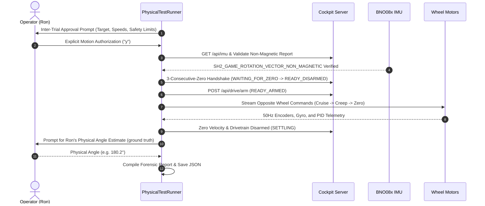

# Rover One Reusable Physical-Test Framework

This document serves as the authoritative operational manual and developer reference for Rover One physical testing.

Per project policy and [`docs/EXACT_MOTION_CONTRACT.md`](file:///c:/Users/Ron/electronic_projects/esp/esp-maker-usba-4motor/docs/EXACT_MOTION_CONTRACT.md), the practice of creating a new physical-motion script for every test is **deprecated**. All physical motion tests must use the reusable, parameterized test framework located in:

```
tools/rover_tests/
```

> [!IMPORTANT]
> **Safety Invariants**:
> 1. **Operator Approval**: Ron must explicitly authorize motion before every trial.
> 2. **Non-Magnetic IMU**: Only `SH2_GAME_ROTATION_VECTOR_NON_MAGNETIC` is permitted. Any magnetic orientation report triggers an immediate, fail-closed abort.
> 3. **Zero Handshake**: Drivetrain must complete the 3-consecutive-zero autonomy handshake before arming.
> 4. **Cleanup Guarantee**: Drivetrain must always finish stopped, disarmed, and locked on completion, abort, and error.
> 5. **Pytest Exclusion**: Motion test routines in `tools/rover_tests/` are excluded from pytest auto-collection.

---

## 1. Directory Structure

```
tools/rover_tests/
├── __init__.py         # Package declaration and version
├── cli.py              # Canonical CLI entrypoint (rover-test)
├── transport.py        # NativeWSClient, CockpitClient, 3-zero handshake, disarm cleanup
├── sensors.py          # BNO08x non-magnetic validation, YawUnwrapper, GyroIntegrator
├── controllers.py      # AngularApproachController, BaseApproachController
├── turn.py             # TurnParameters, wheel polarity mapping, symmetry verification
├── runner.py           # Multi-trial execution engine, safety watchdogs, Ron approvals
└── reporting.py        # MultiTrialSuiteReport, JSON serialization, Markdown tables
```

---

## 2. Canonical Command: `rover-test turn`

The command is executable via the shell alias or directly via Python:

```powershell
# Using the wrapper script
rover-test turn [OPTIONS]

# Or using Python module directly
python -m tools.rover_tests.cli turn [OPTIONS]
```

### Parameter Reference

| Parameter | Type | Default | Description |
| :--- | :--- | :--- | :--- |
| `--degrees` | Float | **Required** | Turn angle magnitude in degrees (e.g. `90`, `180`, `360`). |
| `--direction` | `cw` \| `ccw` | `cw` | Rotation direction: `cw` (clockwise) or `ccw` (counter-clockwise). |
| `--trials` | Integer | `1` | Number of consecutive test trials to perform. |
| `--max-angular-speed` | Float | `0.80` | Cruise yaw rate in rad/s (per Exact Motion Contract). |
| `--creep-angular-speed`| Float | `0.20` | Creep yaw rate in rad/s (per Exact Motion Contract). |
| `--creep-threshold-deg`| Float | `30.0` | Approach zone threshold where deceleration begins. |
| `--settle-seconds` | Float | `2.0` | Post-motion standstill duration before recording final heading. |
| `--angle-tolerance-deg`| Float | `2.0` | Pass/fail angular error tolerance threshold. |
| `--inter-trial-approval` | Flag | `False` | Requires explicit operator approval before each trial and prompts for Ron's physical ground-truth estimate after settling. |
| `--dry-run` | Flag | `False` | Simulates execution without sending motor power or arming. |
| `--report-directory` | Path | `reports` | Directory where JSON and Markdown reports are saved. |
| `--host` | String | `10.0.0.246` | Rover Raspberry Pi 5 IP or hostname. |
| `--port` | Integer | `3000` | Cockpit server port. |

---

## 3. First Intended Physical Test

The canonical 3-trial 180° clockwise rotation test is:

```powershell
rover-test turn --degrees 180 --direction cw --trials 3 --inter-trial-approval
```

> [!CAUTION]
> **Do not execute physical motion without operator presence and authorization**. During implementation and validation phases, test using `--dry-run` only:
> ```powershell
> rover-test turn --degrees 180 --direction cw --trials 3 --dry-run
> ```

---

## 4. Trial Execution Lifecycle

Every trial follows an unalterable 8-stage sequence:



---

## 5. Non-Magnetic IMU Enforcement

Indoor physical motion must never rely on magnetometer-fused orientation (`SH2_ROTATION_VECTOR`) due to building steel, power wiring, and motor magnetic distortion.

- **Required Report**: `SH2_GAME_ROTATION_VECTOR_NON_MAGNETIC` (report ID `0x08`, wire packet `0x3A`).
- **Fail-Closed Rule**: If the orientation source cannot be verified as non-magnetic, or if `rotVecValid` is false, or if degenerate quaternions are received, the trial **aborts immediately** before arming.

---

## 6. Deprecation of Historical One-Off Scripts

The following scripts located in `scratch/` and root were created for historical one-off tests and are **superseded** by `rover-test`:

- `scratch/execute_clean_single_turn.py` (superseded by `rover-test turn --degrees 90 --direction cw`)
- `scratch/execute_standalone_180deg_cw_turn.py` (superseded by `rover-test turn --degrees 180 --direction cw`)
- `scratch/execute_clean_bidirectional_360_validation.py` (superseded by `rover-test turn --degrees 360`)
- `scratch/execute_8_turn_repeatability.py` (superseded by `rover-test turn --trials 8`)
- `scratch/run_home_return_bidirectional_180_test.py` (superseded by future `rover-test outback`)

> [!NOTE]
> **Preservation Policy**: Historical scripts are preserved for analytical reference and baseline telemetry comparison. Do not delete them. However, all new turn testing must execute via `rover-test turn`.

---

## 7. Adding Future Subcommands (`linear` and `outback`)

The architecture in `tools/rover_tests/` is designed to support additional subcommands without duplicating infrastructure:

1. **`controllers.py`**: Contains `BaseApproachController`. `LinearApproachController` can be wrapped or imported directly.
2. **`linear.py`**: Define `LinearParameters` (distance, speed, direction, approach zone) and wheel speed calculations.
3. **`outback.py`**: Define compound routine chaining `linear` and `turn` segments using `SegmentTracker` for lateral drift tracking.
4. **`cli.py`**: Add subparser commands `linear` and `outback` forwarding to `PhysicalTestRunner`.
5. **Reused Infrastructure**:
   - `transport.py`: WebSocket client, token auth, 3-zero handshake, and disarm cleanup are reused as-is.
   - `sensors.py`: Fresh odometry capture and IMU verification are reused as-is.
   - `runner.py`: The trial loop, operator approval prompt, watchdog monitoring, and Ron estimate collection are reused as-is.
   - `reporting.py`: Ingests linear distance metrics alongside angular metrics.
